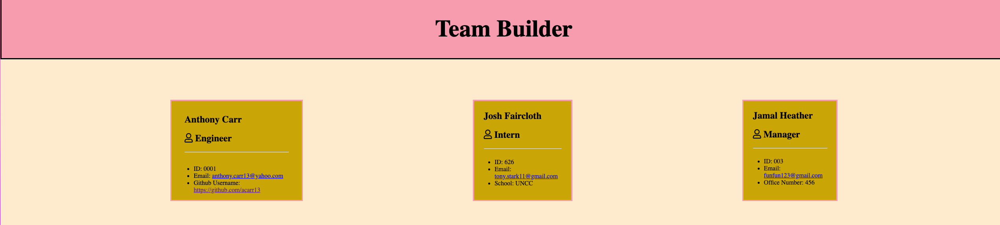
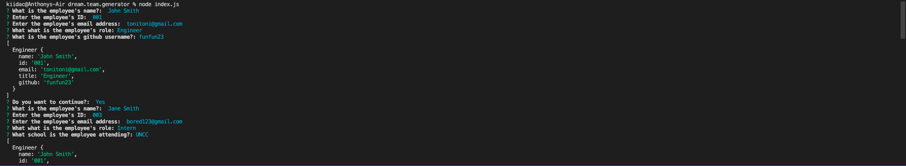

# dream.team.generator

## Task

Your task is to build a Node.js command-line application that takes in information about employees on a software engineering team, then generates an HTML webpage that displays summaries for each person. Testing is key to making code maintainable, so you’ll also write a unit test for every part of your code and ensure that it passes each test.

## User Story

```md
AS A manager
I WANT to generate a webpage that displays my team's basic info
SO THAT I have quick access to their emails and GitHub profiles
```

## Table of Contents
- [Description](#Description)
- [Usage](#Usage)
- [Walkthrough](#Walkthrough)
- [Screenshot](#Screenshot)

## Description
This is an application where the user inputs information to add employees into the team profile using prompts on the command line. This program was created using test driven development to test the js class functions. Once the command line prompts are completed, an html file is created with a team profile website.

## Usage
A professional team profile generator using the command line prompts.

## Walkthrough
[Link to Video](https://drive.google.com/file/d/1iG3_J-Zpq9kd163PdK_pYrPaTYhIYp0R/view?usp=sharing)

## Screenshot




[Link to github repository](https://github.com/acarr13/dream.team.generator)


